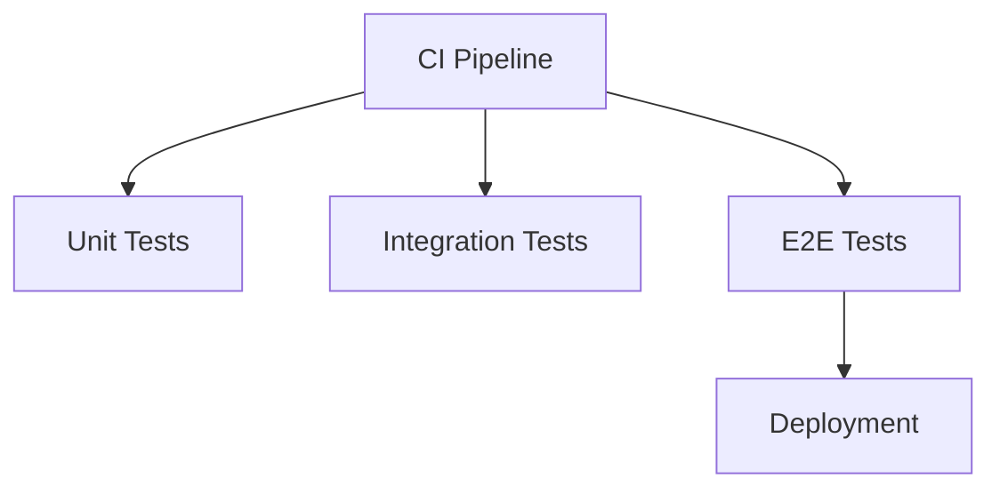

### 2. TEST_STRATEGY.md

````markdown
# Test Strategy

## Testing Pyramid

1. **Unit Tests** (60% coverage)

   - Isolated component testing
   - Business logic validation

2. **Integration Tests** (30%)

   - Service interactions
   - Database operations
   - API contracts

3. **E2E Tests** (10%)
   - Critical user journeys
   - Payment flows
   - Cross-platform scenarios

## Test Automation


````
